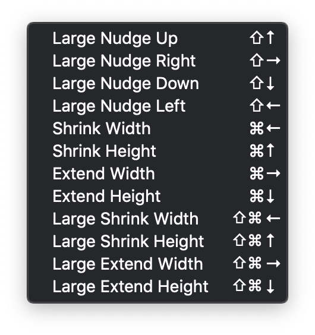
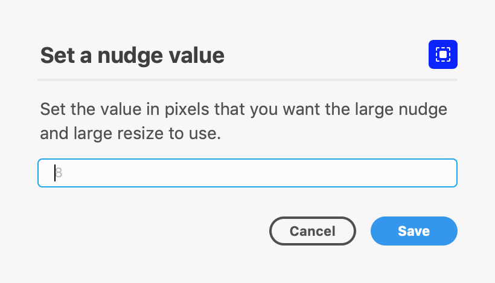

# Nudge & Resize for Adobe XD
Add menu items for nudging and resizing objects (8px by default) so they can be controlled by keyboard shortcuts.

### 1. Search for and install "Nudge and Resize" in Adobe XD plugins directory.

### 2. Set keyboard shortcuts in MacOS

Keyboard shortcuts can't be set by plugins (yet) so you need to add them at the OS level.

These are the ones I use, as they're the ones most other design tools use.

### 3. Use the Settings menu item to change the large nudge/resize value.
The default is 8px but you can change this to whatever you like. Simply enter a whole number, and hit save.

